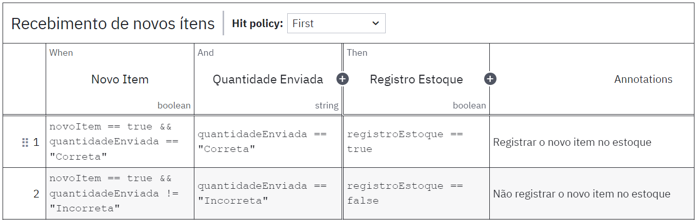
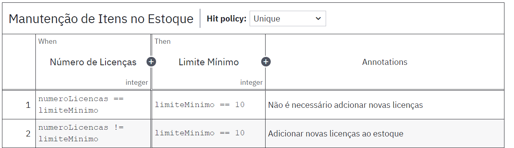
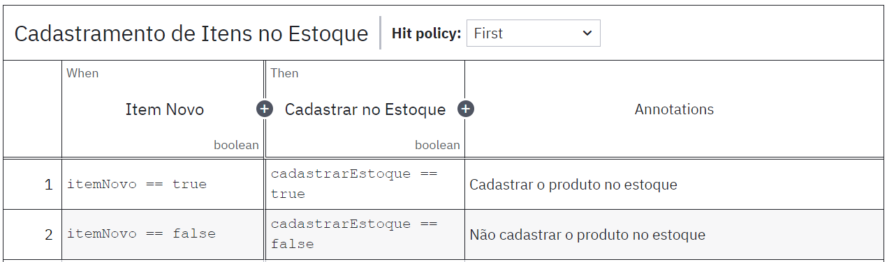
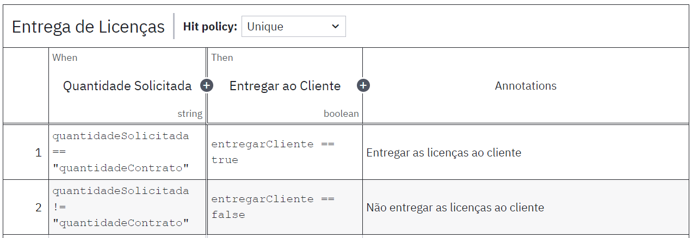
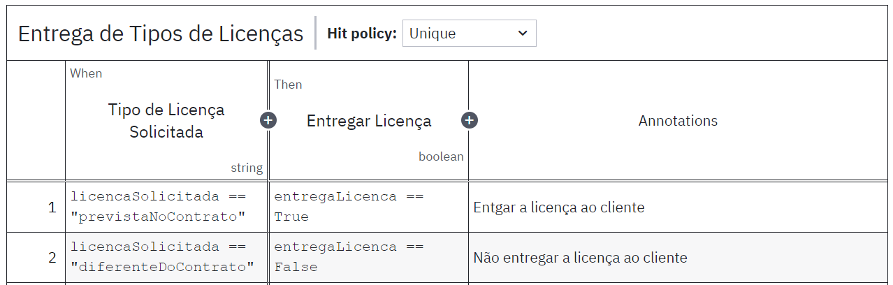

# Ponderada-Afonso---S3

Ps.: Professor, por favor, considere meu esforço a realização desta ponderada. Não entendi muito bem o tutorial que nos foi enviada, a seu pedido, no slack. Fiz o que eu entendi que era pra ser feito através do vídeo. Além disso, não consegui gerar o DRD no Camunda.

| Nº    | Descrição                                         | Critérios de Aplicação                              | Ações                                                                           | Responsável         |
|-------|---------------------------------------------------|----------------------------------------------------|---------------------------------------------------------------------------------|---------------------|
| ES001 | Política de recebimento de novos itens no estoque | Aplicável a novos itens enviados para o estoque     | Receber no estoque apenas cargas de itens em quantidades iguais às estabelecidas nos contratos. | Equipe de Estoque   |
| ES002 | Política de manutenção de itens no estoque        | Aplicável a itens que devem estar presentes no estoque | Manter o número de licenças no estoque acima de x.                                 | Equipe de Estoque   |
| ES003 | Política de manutenção de itens no estoque        | Aplicável ao cadastramento de itens no estoque      | Permitir o cadastramento de estoque negativo.                                   | Equipe de Estoque   |
| ES004 | Política de entrega de licenças                   | Aplicável à saída de licenças do estoque            | Entregar ao cliente somente o número de licenças especificado no contrato.      | Equipe de Estoque   |
| ES005 | Política de entrega de licenças                   | Aplicável à saída de licenças do estoque            | Entregar ao cliente somente os tipos de licença especificados no contrato.      | Equipe de Estoque   |

### DMN - REGRA ES001

Figura 1 - DMN ES001

### DMN - REGRA ES002

Figura 2 - DMN ES002

### DMN - REGRA ES003

Figura 3 - DMN ES003

### DMN - REGRA ES004

Figura 4 - DMN ES004

### DMN - REGRA ES005

Figura 5 - DMN ES005

